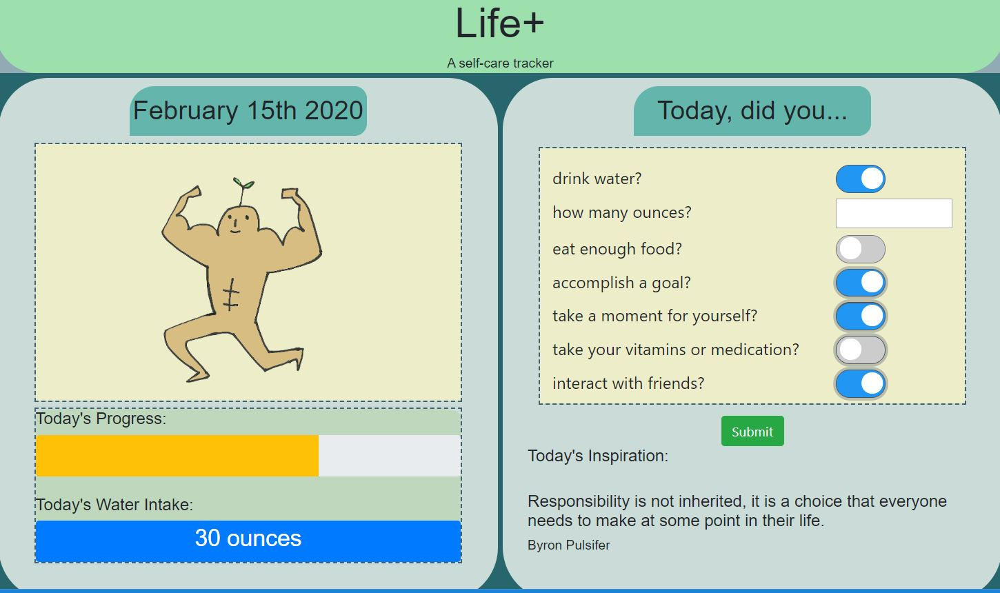

# Group 2 - life+

## Installation

### Front End
* Bootstrap
* Moment.js
* [Inspiring Quotes API](https://www.freecodecamp.org/forum/t/free-api-inspirational-quotes-json-with-code-examples/311373) 
* graphic design by Angela Yu

### Back End
* Node.js
* Express.js
* Handlebars
* Heroku with JawsDB
* Sequelize
* npm dotenv

## Usage

### Today, have you:
* had water?
* taken your medication or vitamins?
* hugged or talked to a friend?
* eaten your meals?
* achieved a goal?
* taken a moment for yourself?

### User Story
* As a human being interested in wellness and general happiness,
* I want to log my progress in 6 self-care areas: hydration, medication or vitamin intake, close friend interaction, food intake, movement, spiritual practice (meditation or prayer), and hobbies, 
* So that I can track my general health and wellness on a daily basis and make sure I'm doing my best to live a good life!

## Contributors 
### Front End
* Liz Alexander @lmalexander
* Angela Yu (project manager) @angeyu

### Back End
* Sarah Dillard @gideonrynn
* Kobii Hoyos-Watkins @kobiihw

## License

## Working Documents
* [Heroku App](https://project2project2.herokuapp.com/)
* [Project 2 Google Doc](https://docs.google.com/document/d/19MVd9TSsCysplNj4eTVMN0gpJKs0w6qPWRiYaUpvdls/edit)
* [Project 2 Presentation Slides](https://docs.google.com/presentation/d/13x5YQRu6OWdkEmewS_UT8PSrp50yULRq-K2wPbrzar4/edit?usp=sharing)
